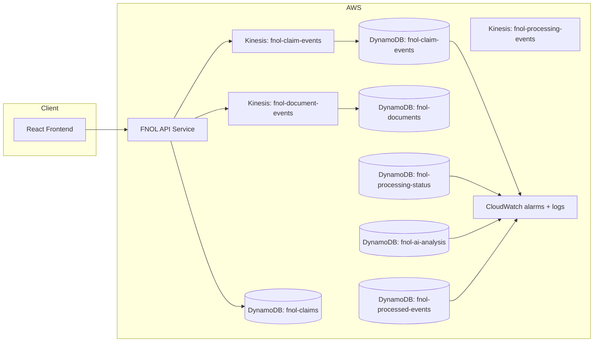

# AWS Architecture Diagram

```mermaid
flowchart LR
    subgraph Client
        UI[React Frontend]
    end

    subgraph AWS
        API[FNOL API Service]
        K1[Kinesis: fnol-claim-events]
        K2[Kinesis: fnol-document-events]
        K3[Kinesis: fnol-processing-events]
        T1[(DynamoDB: fnol-claims)]
        T2[(DynamoDB: fnol-claim-events)]
        T3[(DynamoDB: fnol-documents)]
        T4[(DynamoDB: fnol-processing-status)]
        T5[(DynamoDB: fnol-ai-analysis)]
        T6[(DynamoDB: fnol-processed-events)]
        MON[CloudWatch alarms + logs]
    end

    UI --> API
    API --> K1
    API --> T1
    K1 --> T2
    T2 --> MON
    API --> K2
    K2 --> T3
    T4 --> MON
    T5 --> MON
    T6 --> MON
```
